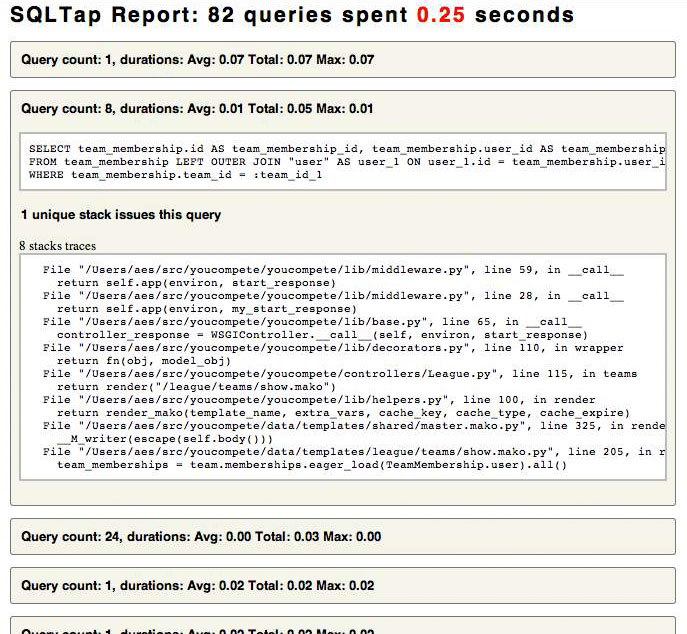

.. sqltap documentation master file, created by
   sphinx-quickstart on Thu Jun 16 23:52:52 2011.

SQLTap - profiling and introspection for SQLAlchemy applications
================================================================

Introduction
------------

sqltap is a library that allows you to profile and introspect
the queries that your application makes using SQLAlchemy.

sqltap helps you understand:
    - how many times a sql query is executed
    - how much time your sql queries take
    - where your application is issuing sql queries from

Motivation
----------
ORM's are notorious for issuing queries that are not performant
or issuing far more queries than necessary. sqltap gives you flexible
visibility into how your application is using SQLAlchemy so you can
find and fix these problems with minimal effort.

Simple Example
^^^^^^^^^^^^^^
This is the bare minimum you need to start profiling your application

::

    sqltap.start()
    session.Query(Knights).filter(who_say = 'Ni').fetchall()
    statistics = sqltap.collect()
    sqltap.report(statistics, "report.html")

Advanced Features
^^^^^^^^^^^^^^^^^
sqltap provides the notion of a context function which lets you associate
arbitrary data with each query as it is issued by sqlalchemy. For example,
in a web framework, you may want to associate each query with the current
request or page type so that you can easily aggregate statistics over
those criteria later.

::

    all_statistics = []

    def on_application_start():
        # Associate the request path, and request identifier with the
        # query statistics.
        def context_fn(*args):
            return (framework.current_request().path,
                    framework.current_request().id)

        sqltap.start(user_context_fn = context_fn)
        

    def after_request():
        # Generate pre-request reports
        statistics = sqltap.collect()
        all_statistics.append(statistics)

        def filter_request(qstats):
            request_id = qstats.user_context[1]
            return request_id = framework.current_request().id

        request_stats = filter(filter_request, statistics)
        sqltap.report(request_stats, "report.html")

    def once_per_day():
        # Once per day, generate reports for each of the major
        # areas of the website
        all_paths = ["/Books", "/Movies", "/User", "/Account"]

        # Get all of the statistics for each page type
        for path in all_paths:

            def filter_path(qstats):
                request_path = qstats.user_context[0]
                return request_path.startswith(path)

            path_stats = filter(filter_path, all_statistics)
            sqltap.report(path_stats, "%s-report.html" % path[1:])

Modules
=======

sqltap
----------------------------------
.. automodule:: sqltap
   :members: start, stop, collect, report, QueryStats

sqltap.ctx
----------------------------------
.. automodule:: sqltap.ctx
   :members:

sqltap.dec
----------------------------------
.. automodule:: sqltap.dec
   :members:
